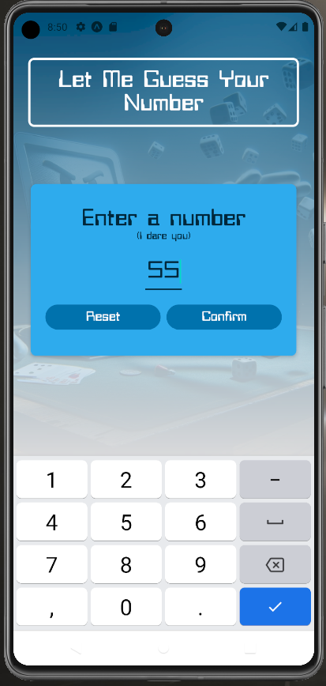
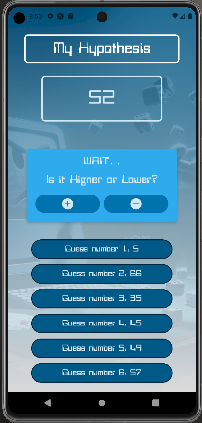

# React-Native Number Guessing Robot Game
First project in React Native with Expo. Pick a secret number and see if the robot can guess it. Simple routing and practice with state management across multiple screens. 

## Install Locally & View on Your Mobile Device

1. Download "Expo Go" App to your mobile device
2. Clone the repo with `git clone [url]`
2. `cd` into the project directory
3. Run `npm install` to install dependencies
4. Run `npm start`
5. Scan the resulting QR code with your mobile device, which will open the app through Expo Go
    * Note: Local machine and mobile device must connected to the same network (public networks are fussy)

## Technology Stack
* Native framework: React Native / Expo

## Screenshots

---

---

